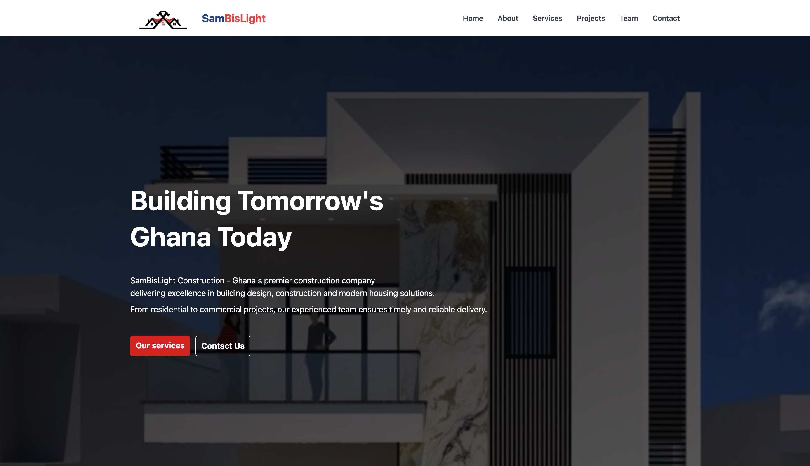

# Sambislight Construction - Company Website

This repository contains the source code for the official company website of **Sambislight Construction Company Limited**. The project is a modern, fully responsive single-page application (SPA) designed to showcase the company's services, portfolio, and provide an easy point of contact for potential clients.

---

## 📸 Screenshot

<!-- Insert a screenshot of the final website homepage here -->



---

## 📜 Project Description

**Sambislight Construction** is a leading construction firm in Ghana. This project aims to establish a strong digital presence for the company, reflecting its professionalism and commitment to quality. The website serves as a digital portfolio, detailing their construction services, showcasing completed projects, and featuring modern homes available for sale.

Built with modern web technologies, the site is optimized for performance and provides a seamless user experience across all devices.

---

## ✨ Key Features

- **Fully Responsive Design:** Adapts to all screen sizes—from mobile phones to large desktops—for a consistent user experience.
- **Single-Page Application (SPA):** Smooth scroll-based navigation without page reloads.
- **Services Section:** Outlines key offerings, including "Design & Build" and "Modern Homes For Sale".
- **Dynamic Project Portfolio:** Interactive image grid with hover effects and modal popups for full-screen viewing.
- **Modern Homes Gallery:** Showcases modern homes available for purchase.
- **Interactive UI/UX:** Enhanced with subtle animations and transitions via `react-awesome-reveal`.
- **Contact Information:** Click-to-call and email functionality for easy client outreach.
- **Professional Footer:** Contains navigation links, company details, and social media placeholders.

---

## 🛠️ Technologies Used

- **Frontend Framework:** [React.js](https://reactjs.org/)
- **Styling:** [Tailwind CSS](https://tailwindcss.com/)
- **Icons:** [Lucide React](https://lucide.dev/)
- **Animations:** [React Awesome Reveal](https://react-awesome-reveal.morello.dev/)
- **Build Tool:** [Vite](https://vitejs.dev/)

---

## 🚀 Getting Started

To run this project locally:

### ✅ Prerequisites

- [Node.js](https://nodejs.org/) (includes npm)
- npm or yarn package manager

### 🧰 Installation Steps

```bash
# Clone the repository
git clone https://github.com/Obayaa/construction_website.git

# Navigate to the project directory
cd construction_website

# Install dependencies
npm install

# Run the development server
npm run dev
```

The app should now be running at `http://localhost:5173` (or another port if 5173 is in use).

---

## 📂 Project Structure

```bash
sambislight-website/
├── public/
│   └── logo.jpeg
├── src/
│   ├── assets/               # Image files
│   ├── components/           # Reusable UI components
│   │   └── SectionTitle.jsx
│   │   ├── Navbar.jsx
│   │   ├── Footer.jsx
│   │   ├── ImageModal.jsx
│   │   ├── Achievements.jsx
│   │   ├── Card.jsx
│   │   ├── ContactForm.jsx
│   │   ├── ContactInfo.jsx
│   │   ├── ContactInfoCard.jsx
│   │   ├── Team_Card.jsx
│   │   ├── ContactForm.jsx
│   ├── pages/                  # SPA section pages
│   │   ├── About.jsx
│   │   ├── Contact.jsx
│   │   ├── Home.jsx
│   │   ├── ModernHomes.jsx
│   │   ├── Projects.jsx
│   │   ├── Services.jsx
│   │   ├── Team.jsx
│   ├── App.css
│   ├── App.jsx
│   └── main.jsx
├── .gitignore
├── index.html
├── package.json
└── README.md
```

---

## ✍️ Author

**Name:** Obayaa  
**GitHub:** [@Obayaa](https://github.com/Obayaa)  
**LinkedIn:** [Your LinkedIn Profile URL]

---

## 🙏 Acknowledgments

- Huge thanks to [Sambislight Construction](https://www.instagram.com/sambislight_construction_ltd?igsh=NHN5a3NvOHhsaXBt&utm_source=qr) for the opportunity to build their digital presence.
- Shoutout to the creators and maintainers of the open-source tools and libraries that made this project possible.

---

> ⚠️ Note: Feel free to fork this repository, use it as inspiration, or adapt it for similar business websites. Contributions are welcome!
